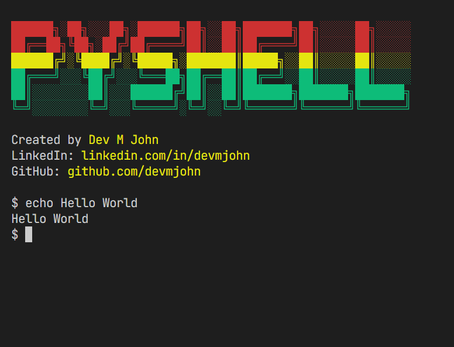

# PyShell

## Overview

This project is a POSIX-compliant shell built in Python, capable of interpreting shell commands, running external programs, and executing built-in commands like `cd`, `pwd`, `echo`, and more. Along the project, I learn about shell command parsing, REPLs (Read-Eval-Print Loop), built-in commands, and other key shell functionalities. The shell provides an interactive environment to execute commands efficiently.

## Features

- Execute system shell commands
- Built-in commands: `echo`, `pwd`, `cd`, `type`, `exit`
- Interactive command-line interface
- Error handling for invalid commands
- Cross-platform support (Linux, macOS, Windows)

# Demo


## Requirements

- Python 3 or above

## Installation

Clone the repository using:

```sh
git clone https://github.com/Devmjohn/PyShell.git
cd PyShell
```

## Usage

To Run the file on Windows/Mac OS/Linux OS

```bash
  cd app
  python3 PyShell.py
```

To Stop

```bash
  exit 0
```

Once inside the shell, you can enter commands like:

```sh
echo Hello, World!  # Prints 'Hello, World!'
pwd                 # Prints the current working directory
cd /path/to/dir     # Changes the directory
type ls             # Checks if 'ls' is a built-in or system command
about               # About of this Project
exit 0              # Exits the shell

```

## Example

```
$ python shell.py
$ echo Hello
Hello
$ pwd
/home/user/python-mini-shell
$ cd ..
$ pwd
/home/user
$ exit 0
Goodbye!
```

## License

<br>
This project is licensed under the MIT License.

## Author

Created By [Dev M John](https://github.com/devmjohn) 🚀. Feel free to connect via [LinkedIn](https://www.linkedin.com/in/devmjohn/).
